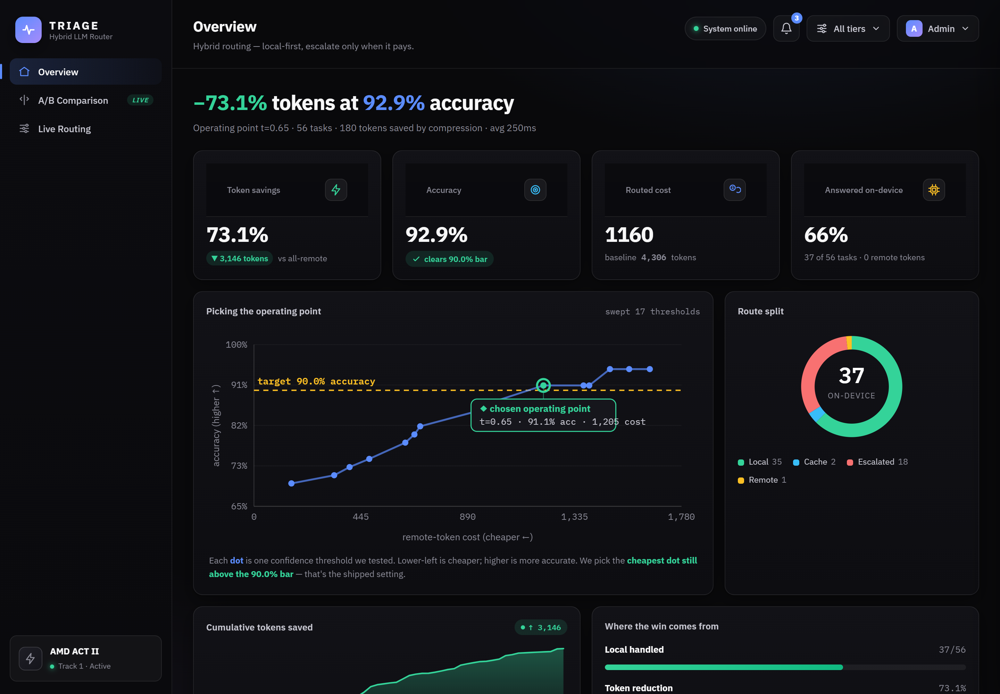
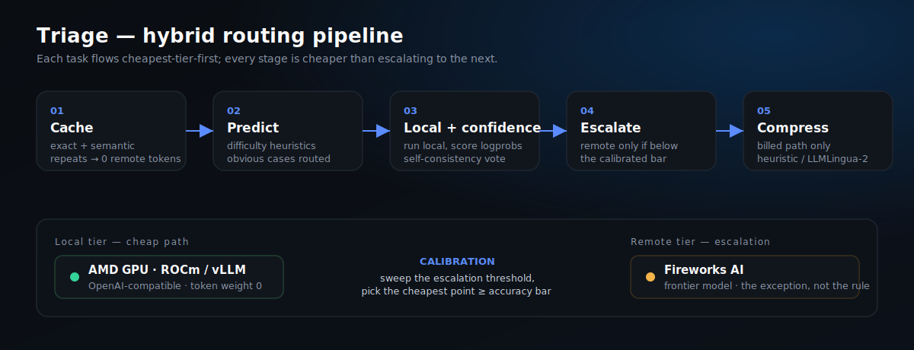
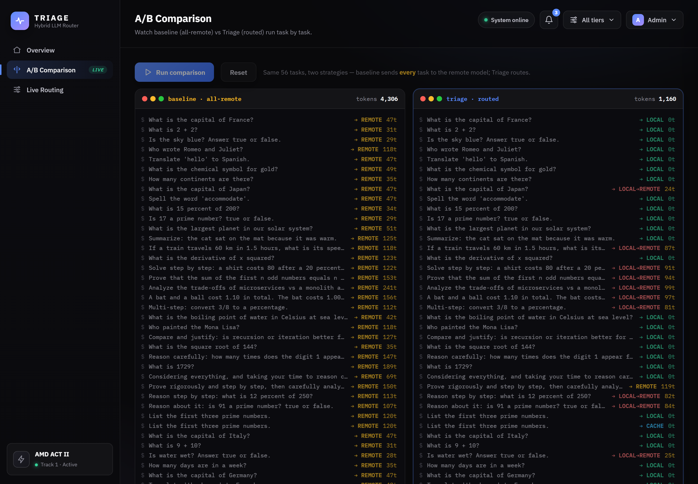
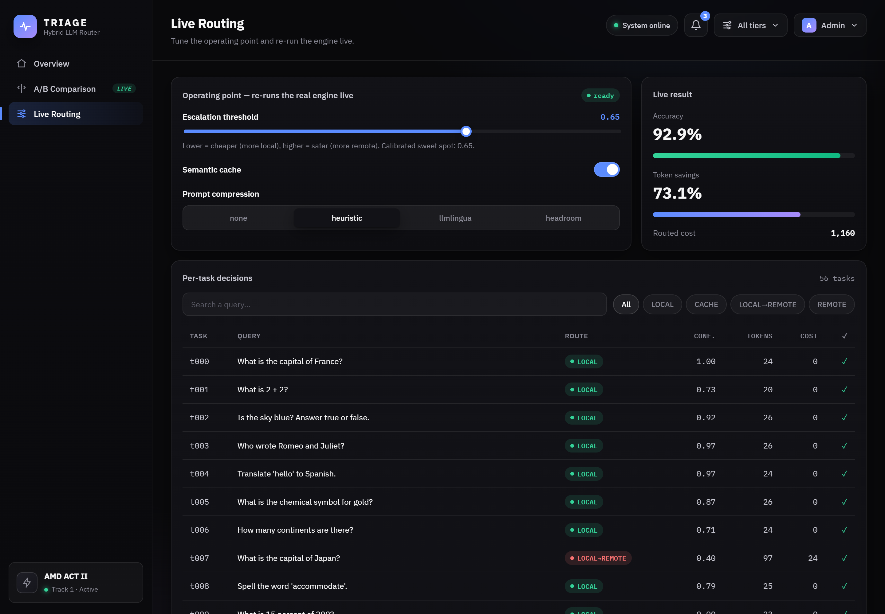
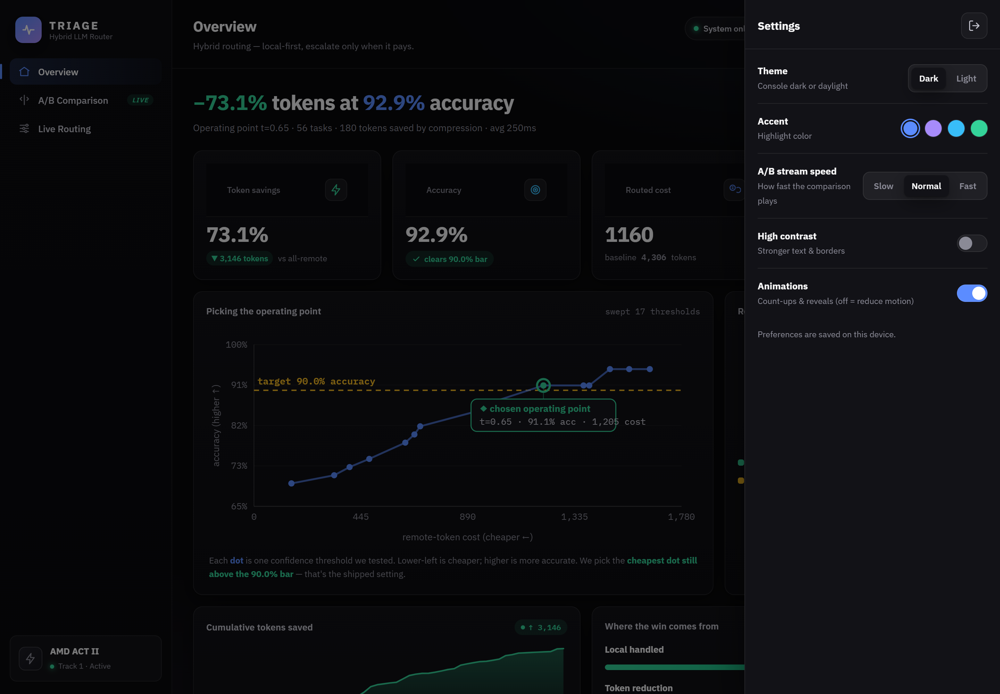
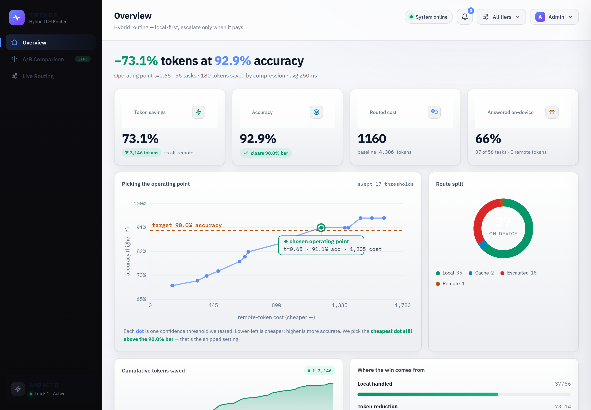
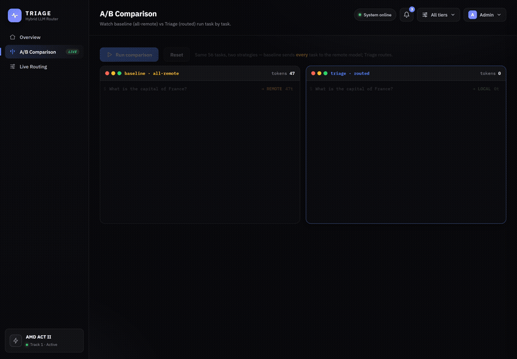

<div align="center">

# ⚡ Triage — token-thrifty LLM router

**Route each task to the cheapest model that still clears the accuracy bar.**

[](https://www.amd.com/)
[](https://www.python.org/)
[](https://fastapi.tiangolo.com/)
[](Dockerfile)
[](tests/)
[](LICENSE)

A hybrid agent that completes each task using the **fewest billed tokens** while staying **above the accuracy threshold** — by *routing*, not by brute compute. Every task is sent cheapest-tier-first between a **local model on AMD GPUs (ROCm / vLLM)** and a **remote model on Fireworks AI**, and the escalation threshold is **calibrated** to sit right on the accuracy bar.

> **On the bundled suite: `92.9%` accuracy at `73.1%` fewer tokens than all-remote — and `100%` on the hardest tier.**



</div>

---

## Table of contents

- [Why this wins Track 1](#why-this-wins-track-1)
- [Results](#results)
- [How it routes (the IP)](#how-it-routes-the-ip)
- [Architecture](#architecture)
- [Screenshots](#screenshots)
- [Quickstart](#quickstart)
- [Testing](#testing)
- [Going live (Jul 6)](#going-live-jul-6)
- [Project structure](#project-structure)
- [AMD platforms](#amd-platforms)
- [License](#license)

---

## Why this wins Track 1

Track 1 is auto-scored on two axes only: **tokens spent** and **answer accuracy**. Everyone can route a request. Triage adds the two levers that actually move that leaderboard:

1. **Calibration** — we sweep the escalation threshold and pick the **cheapest operating point that still clears the accuracy bar** (the Pareto frontier). We sit *on* the line, not above it.
2. **Self-consistency** ([Wang et al., 2022](https://arxiv.org/abs/2203.11171)) — on a low-confidence local answer, draw a few more **local** samples and vote. Unanimous agreement accepts the local answer (skips the remote call); disagreement escalates. Because the local tier is free under the scored cost, this **cuts ~20% of remote tokens with accuracy held exactly**.

Both are established techniques (nothing from the last 30 days), config-gated, and guarded by tests.

## Results

Bundled offline suite — 56 tasks across three difficulty tiers. Regenerate any time with `python -m eval.harness`.

| Metric | Value |
|---|---|
| **Accuracy** | **92.9%** (52 / 56) — clears the 90% bar |
| **Routed cost** | **1,160** tokens |
| **All-remote baseline** | 4,306 tokens |
| **Token savings** | **73.1%** |
| **Answered on-device** | 37 / 56 (66%) — 0 remote tokens |
| **Avg latency** | ~250 ms |
| **Operating point** | `escalate_threshold = 0.65` (calibrated over 17 thresholds) |

**Per-tier accuracy** — hard tasks escalate to remote, so accuracy holds where it's tested hardest:

| Tier | Tasks | Accuracy |
|---|---|---|
| Easy | 25 | 96.0% |
| Medium | 13 | 76.9% |
| **Hard** | 18 | **100%** |

**Self-consistency pays for itself** — same config, samples 1 vs 3:

| | Accuracy | Remote tokens | Savings | Hard tier |
|---|---|---|---|---|
| Single-pass | 92.9% | 1,447 | 66.4% | 100% |
| **+ self-consistency** | **92.9%** | **1,160** | **73.1%** | **100%** |

Accuracy held **exactly**; remote tokens fell **−19.8%**. ([tests/test_tiers.py](tests/test_tiers.py) asserts this can never regress.)

## How it routes (the IP)

Per task, each stage is cheaper than escalating to the next:

1. **Cache** (exact + semantic) — repeats / near-duplicates return with **zero** remote tokens.
2. **Predictive router** — cheap difficulty heuristics send the obvious cases without a wasted attempt: trivial → local, clearly-hard → straight to remote.
3. **Local attempt + confidence** — run local; score adequacy from logprobs / self-signal. On low confidence, **self-consistency** votes over extra local samples before paying for remote.
4. **Cascade escalation** — call remote **only** when confidence is below the calibrated bar.
5. **Token minimization** on every remote call — dynamic few-shot, `max_tokens` + stop budgeting, plus a **pluggable prompt-compression stage** (billed path only, length-gated): a zero-dep `heuristic` backend, or **LLMLingua-2** (Microsoft, 2–5× task-agnostic compression on the AMD GPU) / **Headroom** (reversible) — flipped on via `compression.backend` in config.

**Calibration is the lever.** [eval/harness.py](eval/harness.py) sweeps the escalation threshold and picks the operating point that **minimizes cost subject to accuracy ≥ target**.

## Architecture



Everything is **config-driven** ([config/default.yaml](config/default.yaml)). Launch day = edit config + add a task adapter; no core changes. See [LAUNCH_DAY.md](LAUNCH_DAY.md).

## Screenshots

| | |
|:---:|:---:|
|  **A/B comparison** — baseline (all-remote) vs Triage, task by task. |  **Live routing** — tune the threshold and re-run the *real* engine live. |
|  **Settings** — light/dark, accent, contrast, motion, stream speed. |  **Light theme** — full theming, persisted on-device. |

**The A/B stream, live** — baseline sends every task to the remote model (4,306 tokens); Triage routes the same 56 tasks for 1,160:



> Tip: every screen is deep-linkable — `localhost:8000/#overview`, `/#compare`, `/#routing`.

## Quickstart

### Docker (recommended)
```bash
docker compose up --build
# open http://localhost:8000  — dashboard with a seeded run
```

### Local
```bash
pip install -r requirements.txt

# 1) run the eval + calibration sweep (writes results/latest.json)
python -m eval.harness --config config/default.yaml

# 2) serve the dashboard (API + live websocket + static UI)
uvicorn server.api:app --reload          # http://localhost:8000

# 3) self-check (no network)
pytest                                    # 17 passing
```

The dashboard streams live routing decisions, tokens saved vs an all-remote baseline, accuracy vs the threshold, the route mix, the cost-vs-accuracy Pareto curve with the chosen operating point, and per-tier accuracy.

## Testing

```bash
pytest                       # 17 tests, no network (mock providers)
```

Covers the router, edge cases (cache hit, escalation, pre-route, compression — [tests/test_edge_cases.py](tests/test_edge_cases.py)), and the two leaderboard-movers: the 3-tier suite with per-tier accuracy, and **self-consistency cutting remote tokens without dropping accuracy** ([tests/test_tiers.py](tests/test_tiers.py)). Most modules also carry a runnable `__main__` self-check.

## Going live (Jul 6)

Models and tasks are revealed at kickoff. Offline dev uses `type: mock` providers so the full pipeline + dashboard run without network. To go live: switch the provider `type`s to `fireworks` / `local`, set the model ids and `FIREWORKS_API_KEY`, add a `tasks/` adapter, and re-run the sweep. Template: [`config/launch.example.yaml`](config/launch.example.yaml). Step-by-step: [LAUNCH_DAY.md](LAUNCH_DAY.md).

> **One scoring note:** self-consistency is free *if the leaderboard counts remote tokens* (the default — local weight 0). If it counts **total** tokens, set `cost.w_local_*` > 0 in the launch config and the sweep will price the extra local samples automatically. Both modes are supported in [core/budget.py](core/budget.py).

## Project structure

```
core/router.py            cache → predict → local+confidence → escalate
core/strategies/          predictive · confidence · cascade · calibration · verify (self-consistency)
providers/                base · mock (offline) · openai_compatible (Fireworks/local) · factory
cache/ prompts/ budget    semantic cache · prompt compression · token→cost
tasks/                    Task + evaluators + sample/edge/tiered suites (real tasks swap in Jul 6)
eval/harness.py           accuracy + cost + threshold sweep + Pareto report → results/latest.json
server/                   FastAPI API + websocket + static observability dashboard
scripts/shots.sh          regenerates the README screenshots + GIF (Chrome + ffmpeg)
```

## AMD platforms

- **Local tier** runs on **AMD GPUs via ROCm / vLLM** (OpenAI-compatible) — the cheap path.
- **Remote tier** is **Fireworks AI** — the escalation path, the exception not the rule.
- [docker-compose.yml](docker-compose.yml) includes a commented `rocm/vllm` service for the local model.

Submission assets (video script, cover spec, slides): [docs/DEMO.md](docs/DEMO.md).

## License

[MIT](LICENSE) © Auenchanters
